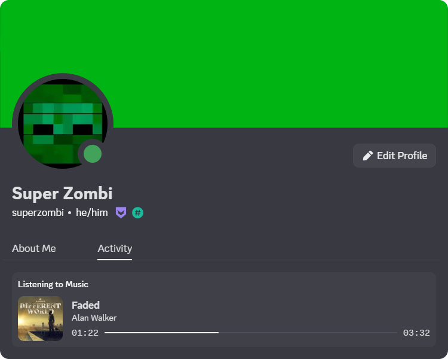

# Discord Music Status
### Shows what's playing as Discord status

# Usage:
### Powered by Windows Media:
1. Download [DMS Windows Media.exe](https://github.com/SuperZombi/Discord-Music-Status/releases).
2. Launch Discord.
3. Launch app.
4. Play the music. (Media info is taken from Windows Media Center)

### Powered by Browser Media:
1. Download [DMS Browser Media.exe](https://github.com/SuperZombi/Discord-Music-Status/releases).
2. Launch app.
3. Install Extension:
    -  [Chrome Store](https://chrome.google.com/webstore/detail/ebelhijmeagkemnleamodjoknjjhfkja)
    -  Firefox Store (soon)
4. Restart Browser (if it was running).
5. Launch Discord.
6. Play the music. (Media info is taken from your Browser Media Center)
